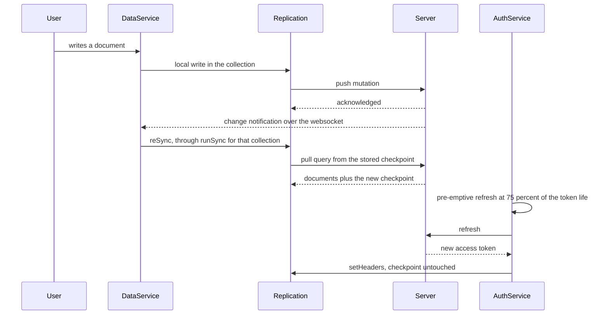
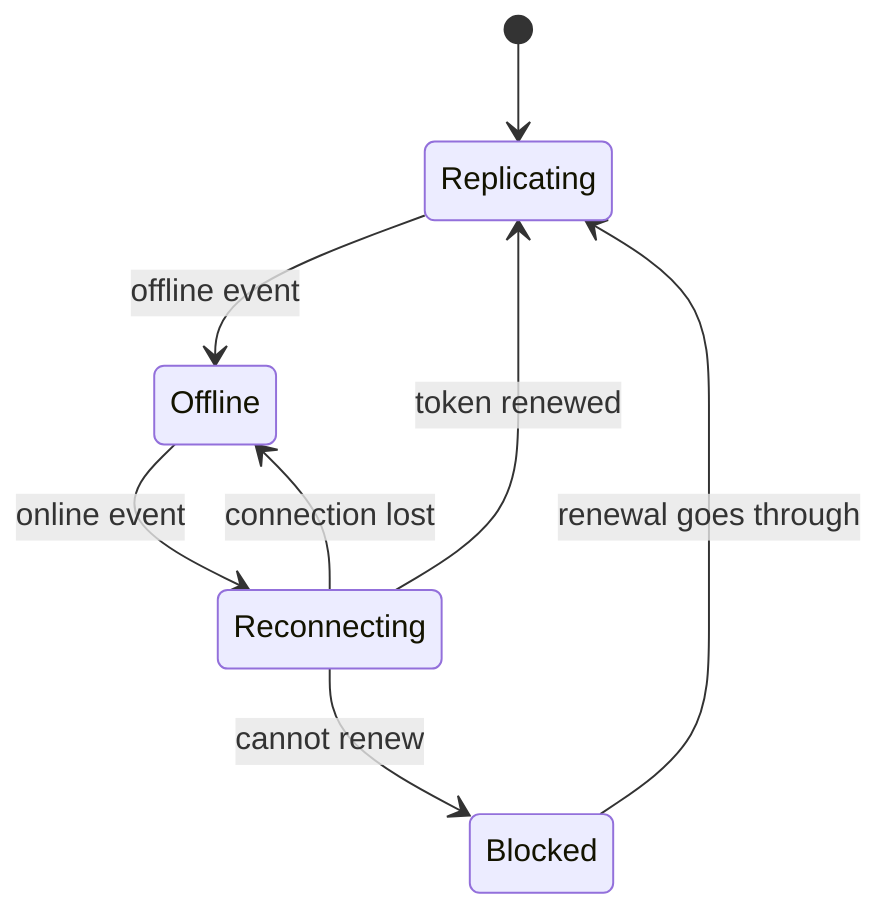
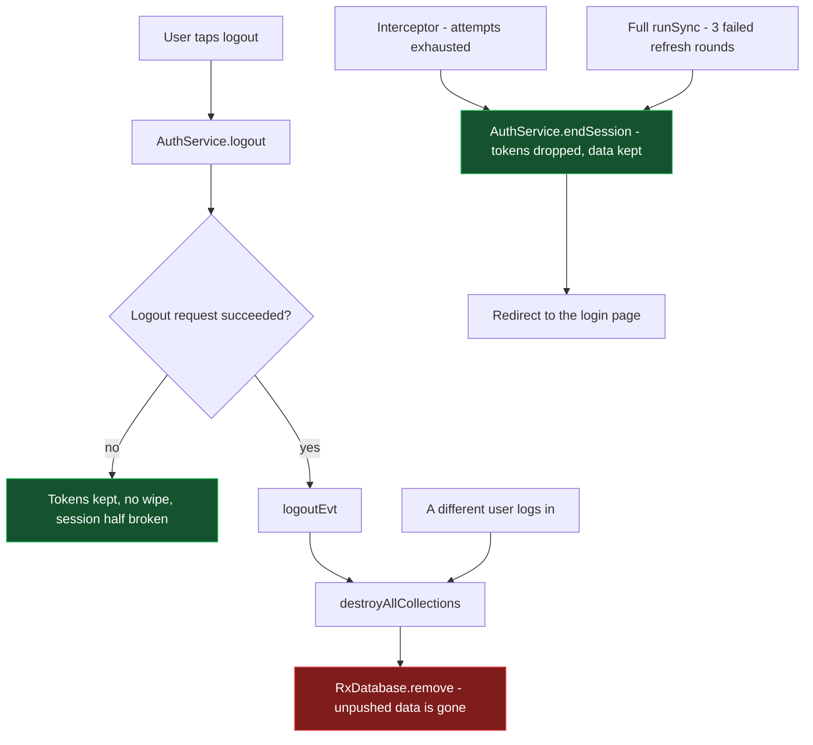

# How the sync works

Reference for the sync as it stands on `sync-problems`, with the differences from `dev` that matter.
Written against the constraint the deployments impose: **the app is used where connectivity is
unstable or absent for days, and data collected offline must never be lost.**

The invariant everything else serves: **local data is destroyed only by a deliberate act** — the user
logging out, or a different user logging in on the device. No failure the app detects by itself
deletes anything.

## 1. The pieces

| Layer | Contents | Survives |
| --- | --- | --- |
| rxdb collections, Dexie/IndexedDB | every document, including writes not yet pushed | app restart, PWA discard, days offline |
| rxdb replication meta instance, same database | pull checkpoint and push state per `replicationIdentifier` | app restart, replication `cancel()`, a session that ends |
| `localStorage` | auth token, refresh token, user info, auth/data config, the owner record | app restart; the tokens and the user info are cleared by a logout, by `endSession()` and by `resetAuth()` on every visit to the login page |

Who does what:

- **`DataService`** owns the database, the collection registrations and the replications, and decides
  when a sync cycle runs.
- **`AuthService`** owns the tokens: it renews them, reports the session state on `authenticated`,
  and ends a session locally with `endSession()`.
- **`JWTInterceptor`** watches `HttpClient` traffic — never the replications, which use rxdb's own
  `fetch` — refreshes and replays a request that failed authentication, and reacts to reconnections.
- **`AuthGuard`** decides whether a navigation proceeds; offline it never blocks.
- **`MainNav`** is where the user sees all this: the sync icon, its badge and its tooltip.

## 2. Normal operation

### 2.1 Starting a session

1. **Database.** `_createDatabase()` awaits any pending teardown (30s cap) and retries creation up to
   five times, one second apart: rxdb releases a database name asynchronously, so a logout followed
   at once by a login used to throw DB8 and leave the app with no database. If the owner recorded for
   that database is a different user, the storage is removed first — see §4.
2. **Collections.** `createCollection()` waits for the database of the session it was asked for,
   retrying a bounded number of times (30 × 1s), and reports an exhausted registration through
   `_reportCollectionError()`: console, `problemSyncing` badge, Sentry. A collection that fails to
   register is absent for the whole session, and used to fail silently.
3. **Replications.** `_initSync()` reacts to
   `combineLatest([registeredCollections, authToken, isOnline$, authenticated])`. Authenticated,
   online and holding a token, every registered collection without an active sync gets
   `_setupCollectionSync()`.

### 2.2 The steady state, online

**Pull.** `pullQueryBuilder` asks for what changed after the checkpoint. `pullResponseModifier`
returns the last document as the new checkpoint and, when the response is empty, **returns the
checkpoint it was asked from**. Resetting it to the epoch — what happened before — made the next
cycle re-download the whole collection, on every cycle, for a synced app.

**Push.** `pushQueryBuilder` sends what rxdb considers unpushed. A push rejected with a
`constraint-violation` is retried up to `retrySyncMaxAttempts` (3) through `syncErrorEvt`, then given
up on with `couldNotSyncEvt` — see §7.

**A full sync**, the icon in the main nav, refreshes the token and then asks every active sync for a
cycle with `reSync()`. It reuses the replication states, so the checkpoints stand: it used to be an
implicit side effect of the token renewal, which tore down and recreated every replication.

### 2.3 Going offline, and coming back

**Offline** stops every replication — `_initSync()` takes its `else` branch — and keeps the documents
and the push state on disk. `checkToken()` reports the token as usable while offline whatever its
expiry, so `authenticated` stays true, the guard never blocks, and the app keeps working on local
data. `refreshToken()` short-circuits to `true` without a request, so **no retry budget is ever spent
offline**, however long it lasts. The pre-emptive timer re-arms with a 60s floor until the token
actually expires and then stops: a handful of wake-ups, then silence for days.

**Reconnecting** is driven by the interceptor's handler on `isOnline$`, where `skip(1)` comes before
`filter(res => res === true)` so that a session which *started* offline is not skipped — the normal
case for a tablet whose PWA was discarded and relaunched without a network. It re-evaluates the token
and refreshes if needed. Meanwhile the replications restart and their first rejected JWT asks for a
refresh too; the call is single-flight, so both paths share one request.

On success the replications resume from their stored checkpoint, which is what pushes the backlog. On
failure nothing is torn down: the app moves to **Blocked**, described in §3.

### 2.4 Renewing the token

The access token lives 900 seconds. The refresh is scheduled at **75% of that lifetime**, 11m15s,
leaving 3m45s of margin — enough for a wrong device clock, a slow round trip and a background timer
throttled by the browser. A refresh at expiry would instead be discovered by whatever request fails
first, which is how a renewal becomes an error path.

Refreshes are **single-flight**: interceptor, guard, pre-emptive timer and replications share one
call, so a slow link does not queue several, and `authToken` emits once instead of once per caller —
each emission makes the data service reconfigure every running replication.

A renewed token reaches the replications with `setHeaders()`. The replication state, and therefore the
checkpoint, is untouched: recreating them restarts from the checkpoint, which re-pulls whole
collections and can trigger a mass push — a heavy cycle to pay every eleven minutes.

## 3. When the token cannot be renewed

A failed refresh proves nothing: `refreshToken()` reports the same negative result for a 5xx, a
timeout, a request that failed while `navigator.onLine` was still true, and a credential the server
has revoked. So a failure changes as little as possible.

**The session state is untouched.** Three places used to report `authenticated: false` on a failed
refresh — the auth service's `catchError`, the interceptor's reconnection handler and
`_initAuthentication`, whose subscription outlives the service and re-runs on every network
transition. Any of them dismantled the session: the permission context reset, so the permissions
retried and gave up on an empty list and the menu emptied; the replications stopped; the user name
disappeared. Coming back online after days offline hit the third one every time, since the access
token is always expired by then. None of them reports it any more: an expired access token with a
refresh token in hand is a session to renew, and what decides is the refresh itself.

**The budgets are per source, and they only end the session.** A full `runSync()` skips the cycle and
counts: at three consecutive failures it ends the session — a backstop in practice, since the first
failure lights the badge and the next tap on the icon takes the login route instead, and every full
sync in the app goes through that guard. The interceptor allows
`retryAttemptsMax` (1 in every environment) failed refresh *rounds* before ending it — rounds, not
requests, because the call is shared and several requests failing inside one round trip are one
attempt. Offline neither counts anything.

**Ending a session is not a logout.** `endSession()` drops the tokens, cancels the pre-emptive timer
and reports `authenticated: false` with `evt: 'expired'`. No http call, so it works offline too.
Nothing is destroyed: the next login starts from a new refresh token and resumes the replications from
their checkpoint. It also clears what belongs to the session and not to the data — `dbToken` and the
registered collections — because those hold handles of the database being left, and a re-registration
is dropped as a duplicate by name: the next session would otherwise replicate collections of a closed
database, or register against a stale token and report itself done.

**What the user sees.** A failed renewal adds an `authentication` entry to `problemSyncing`, which
lights the badge on the sync icon — the only signal that reaches a user in the field, since the report
that goes with it ends up in Sentry. The entry follows whether the token is *usable*, not whether the
call reported success: offline it reports success without trying, and clearing the badge on that
switched it off while nothing had been renewed. Any renewal that goes through clears it, whoever asked
for it: only two of the five paths that renew a token used to report, so the badge could stay lit after
the session had recovered through the guard or the interceptor — and the icon then sent the user to log
in again for nothing.

The spinner is off whenever there is nothing to wait for: blocked on the token, or with no replication
active at all. And after three consecutive failed renewals the replications stop — they cannot succeed
without a token, and rxdb would retry every five seconds for as long as the app stays open, which on a
field device is battery and data for nothing. The session and the data are untouched; a renewal that
goes through brings them back.

**The way out is the icon.** Tapping it while the session needs renewing ends the session and goes to
the login page, instead of starting a cycle that cannot succeed. That route matters: the only path to
a login page a user knows is the logout button, which is the one action that destroys the data on the
device. `LoginGuard` also closes the login route while the app still reports itself authenticated, so
ending the session first is what makes the page reachable at all. There the notice names the account
whose data is on the device, and the backlog goes out on the next login.

## 4. What destroys local data

`RxDatabase.remove()` is the only operation that deletes documents, and it is reached from two places,
both requiring a deliberate act.

**An explicit logout**, through the `logoutEvt` subscription. Note that `logoutEvt` is emitted inside
the `tap` of the logout http call, so a logout whose request never reaches the server clears nothing:
there the data survives by accident, not by design.

**A different user logging in.** `_removeDataOfPreviousUser()` runs inside `_createDatabase()`, before
the new session gets a database. It compares the logged in user with the owner recorded in
`dino_db_owner:<database name>` and, when they differ, removes the storage — through
`_teardownDatabase()` if an instance is open, otherwise `removeRxDatabase()` by name, so a fresh app
start does not have to open the previous user's database just to throw it away. This is what keeps "a
session that ends without wiping" from becoming a privacy leak between operators sharing a tablet.

The owner record carries the account name next to the id, because it is read where nothing else is
left to ask: the core `LoginComponent` constructor calls `resetAuth()`, which clears the tokens, the
user info and the auth config on every visit to the login page. A record written before the label
existed, a bare user id, still reads as an owner with no label, and the next login rewrites it.

Everything else deliberately stops short: a refresh that fails on reconnection, any authentication
failure while offline, and a replication whose JWT is rejected. The last one is worth spelling out:
replications use rxdb's own `fetch`, so they never reach the interceptor or its budget. A rejected JWT
surfaces on `state.error$`, is recognised by `hasJwtAuthError()` and emits `_refreshEvt`, which is
`exhaustMap`-ed into a single refresh. Twenty collections failing at once produce one request and no
logout risk.

## 5. Differences from `dev`

| Area | `dev` | now |
| --- | --- | --- |
| Interceptor retry budget | never reset; the 2nd auth failure of the session logged out and wiped | reset by every successful refresh, and counted per refresh round |
| Pre-emptive refresh | none; the token expiry was discovered by a failing request | at 75% of the lifetime, re-armed offline with a 60s floor |
| Token expiry check | `exp > now`, throws on a malformed token | 10s skew, never throws |
| Concurrent refreshes | one call per requester, each emitting `authToken` and reconfiguring every replication | single-flight |
| Reconnection refresh | dead code: `if (!check)` on an object | live, and no longer skipped for a session that starts offline |
| Interceptor on 401 | returned `obsOf(null)` to the caller and replayed the request into the void | refreshes, replays with the current token, returns the real response |
| A failed refresh | reported `authenticated: false`, resetting the permission context and stopping the sync | changes nothing but the badge |
| `runSync()` refresh failure | logout and wipe on the first one | skip the cycle; the session ends after three |
| A full sync | implicit: a token change tore down and recreated every replication | `reSync()` per active sync, checkpoints preserved |
| Token renewal cost | full replication restart, whole-collection re-pull, mass push | `setHeaders()` on the running replication |
| Empty pull response | checkpoint reset to the epoch, endless re-pull | the requested checkpoint is preserved |
| A session the app gives up on | logout: tokens cleared, database destroyed | `endSession()`: tokens dropped, data kept, redirect to login |
| Sync spinner | turned while nothing could replicate, and stayed on with no active sync | off when there is nothing to wait for |
| Sync badge | fed only by push retries and failed registrations | also by a token that cannot be renewed, with a tooltip that says what to do |
| Logout → login race | DB8, app left with no database | teardown awaited, creation retried |
| Infinite `retryWhen` loops | permissions and user data retried forever | bounded, with fallbacks |
| Failed collection registration | silent | console error, badge, Sentry |
| `NetworkStatusService` | one subscription per subscriber, bogus status history | shared, real transition history |

One consequence deserves calling out: **a logout now reliably destroys the local database, where on
`dev` it sometimes did not.** `dev`'s `forkJoin` over an empty registered-collection list never
emitted, and an unbounded wait on a replication cancellation could skip the removal entirely. Those
accidents occasionally preserved offline data across an unwanted logout. They are gone, which is why
no automatic path may reach a logout any more.

The removal is not the recovery path for a schema change, either. rxdb keys its internal collection
document by name **and** version — `_collectionNamePrimary()` returns `name + '-' + schema.version` —
and DB6 is thrown only when that document already exists with a different schema hash. A bumped
`version` with its `migrationStrategies` entry takes a different key, never conflicts and gets
migrated. DB6 means the schema changed *without* a bump: no version transition, nothing to migrate, so
rxdb refuses rather than guess. It is a developer mistake whose fix is the bump; the wipe on logout
only hid it, and undependably, since it needs the user to log out.

## 6. Measured backend behaviour

The client's exposure to a bad link depends on how the credentials behave, so it was measured by hand
against the current instance (2026-08-25) rather than assumed.

| Fact | Measured | Consequence |
| --- | --- | --- |
| The refresh token does not rotate | `/v1/token` returned the same token it was given; three parallel calls with one token all returned 200 | A refresh response lost in flight costs nothing: the stored token is still the right one |
| Its expiry is a sliding 30-day window | `auth.refresh_tokens.expiresAt` moved across one refresh, each time to `now + 30 days` | No calendar wall from the login. The credential is lost only after 30 consecutive days without one successful refresh |
| The refresh endpoint ignores the `Authorization` header | A call succeeded three minutes after the Bearer it carried had expired | Coming back after days offline works: only the refresh token in the body matters |
| Access tokens live 900s | `accessTokenExpiresIn: 900` | The pre-emptive refresh fires at 11m15s |

None of this is a contract: it is backend configuration. Enabling single-use rotation, or a fixed
expiry, would each reintroduce a way for the credential to die while the device holds unpushed data,
so no client code depends on these four rows.

## 7. Known limits

**A rejected push blocks a collection, and retries it noisily.** Three push failures with a
`constraint-violation` lead to `couldNotSyncEvt`, which stops that collection: the badge names it, the
data stays on disk, nothing reaches the server. With the default `batchSizePush` of 20000 the whole
pending queue travels in one mutation, so one document the server refuses blocks everything behind it,
and the app names the collection but not the document — the GraphQL message in the console and in
Sentry is the only clue.

It does not stay stopped, and that is deliberate. `_initSync()` reacts to `authToken`, which emits on
every token renewal, and the collection is still registered, so it is set up again about every eleven
minutes, fails its three attempts and stops again — a document the server refuses today may be
acceptable tomorrow, and reaching in-sync is what proves the queue finally went through. What that
round does **not** do any more is clear the badge or repeat the report: the collection stays in
`_abandonedCollections` until it catches up, so the signal persists and Sentry hears about it once.

That matters because of what the user is expected to do with it: the session stays alive on purpose,
so they can see the error, export the local database from the user area, and choose when to log out —
the only way out of this state, and the one action that destroys the data. A badge going dark for
minutes at a time worked against exactly that decision.

Tapping the sync icon does not touch such a collection — it is no longer among the active syncs — and
never leads to the login page: that budget counts failed refreshes, and here the refresh succeeds.
Three "Resyncing" snackbars per round still appear.

**Permissions degrade to "not allowed".** `boundedRetry` replaced the infinite `retryWhen` in
`PermissionContextService.getAllowedActions()`, `FormDataManager.hasAllowedFormStatus()`,
`UserDataManager.getActiveUserData()` and `UserGroupManager`. On exhaustion — ten attempts, two
seconds apart — the fallbacks yield `[]`, `false` and `null`. Better than a spinner that never
resolves, but a session whose referenced documents never arrive can end up read-only after twenty
seconds.

**A dead credential needs the user.** With a refresh the server keeps rejecting, the app stops the
replications, lights the badge and waits: it does not send anybody to the login page on its own, and
the remedy is one tap on the icon. Nothing else can be done without the network and the credentials
anyway, and being pushed to a login page would interrupt the collection of data — which is the whole
point of keeping the session alive.

**Two things worth calibrating**, both left as they are on purpose: `retryAttemptsMax` is `1` in every
environment, which is eager on a flapping link now that the consequence is a login page rather than a
wipe; and every skipped sync cycle is reported to `ErrorHandlerMessageService` as a warning, which on
a bad link is a stream of Sentry events for a normal condition.

**The token lives in two places.** A running replication carries the token it was created with, while
the auth checks read `localStorage`. They cannot diverge in normal use, since the auth service writes
both — but a second tab of the same app can: a logout there clears the storage while this tab keeps
replicating with the token it holds in memory, and nothing listens for the `storage` event.

## 8. Verifying by hand

The suites do not cover these paths convincingly, and one manual session found five defects none of
them had caught: a failed refresh dismantling the session, the login notice never naming the account,
`dbToken` and the registered collections left behind by a session end (two distinct symptoms), the
badge switched off by a brief offline moment, and the way back to the login page passing through the
button that destroys the data. Repeat this before merging anything that touches the sync.

Keep the DevTools open on Network, Console, and Application → Local Storage plus IndexedDB. In dev the
useful logs are on: `Running the sync for …`, `COULD NOT REFRESH THE AUTH TOKEN BEFORE SYNCING`,
`<collection>: sync token renewed without restarting the replication`, `CREATING DB: …`,
`Stopping sync`.

1. **A full sync does something.** Tap the sync icon: one call to the refresh endpoint *and* the
   GraphQL queries of every collection.
2. **Offline collection.** DevTools offline, create a record: it stays in IndexedDB, nothing goes out,
   no console noise, and repeated taps on the icon do nothing.
3. **A session that ends.** Back online, break the stored refresh token, then tap the icon three
   times, waiting for each call. Expect `attempt 1/3` … `3/3`, then `login/sync_error` — with
   IndexedDB intact, the tokens gone, the owner record still there, the notice naming the account, and
   **no call to the signout endpoint**.
4. **The backlog.** Log in with the same account: the record from step 2 leaves in a push mutation.
5. **Reconnection from an offline start.** Offline, replace the stored access token with a non-JWT
   string, reload, then go back online without touching anything: a refresh request must fire by
   itself.
6. **A dead credential.** With both tokens broken and the app online, wait: badge on, spinner off, the
   replications stop after three failed renewals, and the tooltip on the icon asks for a new login.
   One tap must land on the login page.
7. **A different user.** From there, log in with another account: the database is recreated empty and
   the owner record names the new user.
8. **An explicit logout.** From the menu: the signout call, IndexedDB removed, the owner record gone,
   and no notice on the login page.

Steps 7 and 8 destroy the local database on purpose — they are the proof that the destructive path
still works when it should. Leave them last.

All eight steps were run against this branch on 2026-08-27, against the dev instance, and passed. The
five defects listed above were found and fixed during those runs; nothing was left open.

## 9. Test coverage

`projects/core` is green at 162 specs. The ones that pin this document down:

- `logout-login.spec.ts` — logout followed at once by a login; the data surviving a session end; the
  collections re-registering on the database of the new session; a different user finding an empty
  database; the owner record and its label.
- `data-service.spec.ts` — the pre-sync refresh budget, the single-flight counting, the badge, the
  spinner off when blocked or idle, the replications stopping, a full sync reaching every active sync.
- `auth-service.spec.ts` — `endSession()`, the offline re-arm of the pre-emptive refresh and its 60s
  floor.
- `jwt-interceptor.spec.ts` — a 401 and a 200 carrying a GraphQL `invalid-jwt`; no logout on a
  transient failure; the session ending when the attempts run out; the refresh on the first
  reconnection of a session that started offline.
- `auth-utils.spec.ts`, `bounded-retry.spec.ts`, `local-data-owner.spec.ts` — expiry with skew,
  malformed tokens, retry bounds, the owner record.

Each fix in this document was verified by reverting it and watching its test fail. The Cypress suites
have never been run against this branch.
