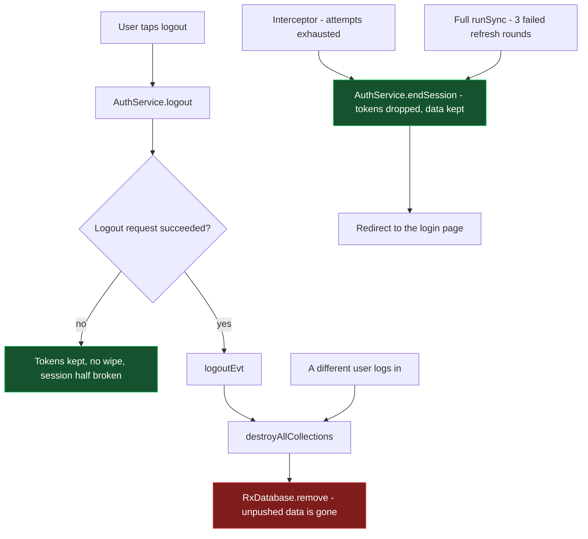
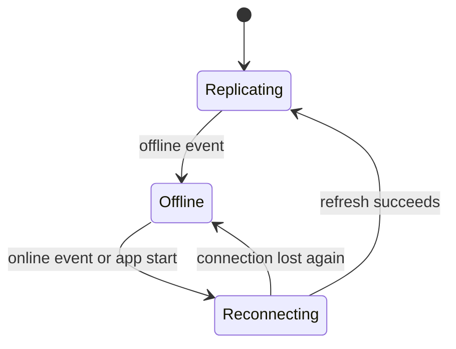

# Sync mechanism — how it works on `sync-problems`, and how it differs from `dev`

Audience: developers merging `sync-problems` into `dev` and then `main`.

The deployment constraint this document is written against: **the app is used in places where
connectivity is unstable or absent for days, and data collected offline must never be lost.**
Everything below is evaluated against that single requirement.

## TL;DR

- Local data lives in IndexedDB (rxdb + Dexie). Nothing in the sync path deletes it. The **only**
  thing that destroys it is a database teardown, and the only trigger for a teardown is a
  **logout**.
- Therefore "no data loss" reduces to one question: **can the app log the user out on its own?**
  It can, from three places. This branch makes two of them much harder to reach than on `dev`, and
  makes one of them reachable where on `dev` it was dead code.
- Compared to `dev`, this branch is **substantially safer**: on `dev` an idle session was
  guaranteed to hit an automatic logout after the second authentication failure of its lifetime,
  because the retry budget was never reset. That is the single worst data-loss bug in the current
  production code, and it is fixed here.
- Two exposures remain, both introduced or widened by this branch, both listed in
  [Residual risks](#residual-risks) with proposed fixes. Neither is a regression in the "silent
  wipe" sense on its own, but both should be closed before this reaches `main`.

## 1. Where offline data lives, and what can destroy it

| Layer | Contents | Survives |
| --- | --- | --- |
| rxdb collections (Dexie/IndexedDB) | every document, including writes not yet pushed | app restart, PWA discard, days offline |
| rxdb replication meta instance (same database) | pull checkpoint and push state per `replicationIdentifier` | app restart, replication `cancel()` |
| `localStorage` | auth token, refresh token, user info, auth/data config | app restart |

A local write is "safe" as soon as it is in the collection. It becomes "delivered" when the push
replication has sent it and the server acknowledged it. The gap between the two is what days of
offline work consist of.

**Nothing shrinks that gap except a successful push.** In particular:

- `_stopCollectionSync()` cancels a replication. It does not touch documents, and the push state
  lives in the meta instance, so a later `_setupCollectionSync()` with the same
  `replicationIdentifier` resumes and pushes the backlog.
- Going offline stops every replication (see §4). No data implication.
- A failed push leaves the documents where they are and retries.

The one operation that deletes documents is `RxDatabase.remove()`. It is reached from two places
only, and **both require a deliberate act**: an explicit logout, through the `logoutEvt`
subscription in the `DataService` constructor, and a different user logging in on the device,
through `_removeDataOfPreviousUser()`.

Everything the app decides by itself ends at `endSession()`, which drops the tokens and leaves the
data: the two paths above, plus a refresh that fails on reconnection, any authentication failure
while offline, and a replication whose JWT is rejected — the last three do not even end the session.
So the audit reduces to: **who calls `logout()`, and who takes over the device.**

## 2. Where a session ends, and what it costs

### 2.1 `DataService.runSync()` — pre-sync refresh failure

`runSync()` without a collection name refreshes the token before the cycle. A negative result does
not tear the session down on the spot: `_handleSyncRefreshFailure()` increments
`_failedSyncRefreshes` and only emits `_endSessionEvt` at
`MAX_CONSECUTIVE_SYNC_REFRESH_FAILURES` (3). Any refresh that goes through resets the counter.
Every failure is reported through `ErrorHandlerMessageService` — `warning` for a skipped cycle,
`error` for the session end — so a sync that quietly does nothing is visible in the notifications
and in Sentry.

Crucially, `AuthService.refreshToken()` returns `true` while offline without issuing a request, so
**days offline consume none of that budget**.

`dev`: logout, database included, on the *first* negative result, with no budget and no reporting.

### 2.2 `JWTInterceptor._handleAuthFailure()` — a request fails authentication

A 401/400, or a 200 carrying a Hasura `invalid-jwt`/`JWTExpired` error, triggers a refresh and a
replay of the request. Offline it refuses to refresh or end the session and surfaces the error to
the caller, which falls back to local data. `_retryAttempts` is reset by `tokenRefreshedEvt`, so a
successful refresh restores the budget. When it runs out, the session ends and the app navigates to
`login/expired` — with the data still on the device.

`dev`: same shape, except `_retryAttempts` was **never reset**, and `retryAttemptsMax` is `1` in
every environment. The first authentication failure of a session consumed the budget; the second
one — minutes or hours later — logged out and wiped the database. With no pre-emptive refresh on
`dev`, tokens expired every few minutes, so this was not a corner case but the normal end of a long
session. This branch fixes it.

### 2.3 A different user logs in — the one automatic wipe left

`_removeDataOfPreviousUser()` runs inside `_createDatabase()`, before the new session gets a
database. It compares the logged in user with the owner recorded in `dino_db_owner:<database name>`
and, when they differ, removes the storage: through `_teardownDatabase()` if an instance is open,
otherwise `removeRxDatabase()` by name, so a fresh app start does not have to open the previous
user's database just to throw it away. This is what keeps "the session ends without wiping" from
turning into a privacy leak between operators sharing a tablet.

### 2.4 `JWTInterceptor` reconnection handler — `online` event with an expired token

On reconnection the interceptor re-evaluates the token and refreshes if needed. A failed refresh here
changes nothing at all - see §2.5 - and the retry is left to the replications, to the guard on the
next navigation or to the next sync cycle. See R1.

`dev`: this path was dead code. It read `withLatestFrom(this._authService.checkToken())` and
tested `if (!check)`, but `checkToken()` returns an object — always truthy — so the branch never
ran. Fixing that condition on this branch enabled the useful behaviour, a refresh on reconnection.

### 2.5 One failed refresh changes nothing

A refresh that fails used to report `authenticated: false`, in the auth service's `catchError` and in
the reconnection handler. That single emission dismantled the session: `PermissionContextService`
resets the context on any `auth === false`, so `getAllowedActions()` restarted, gave up after its
bounded retries and returned `[]` - an empty menu; `_initSync()` took its `else` branch and stopped
every replication, closing the websocket; and the main nav hid the user block, which is bound to the
same flag. Nothing was left running to recover, so the state persisted.

It was invisible on `dev`, where the first failure went straight to logout, wipe and redirect. The
budgets of this branch are what made it observable - and it was found by running the app, not by the
suite.

Three emissions are gone, the third found by running the app one step further. `_initAuthentication`
keeps a subscription to `checkToken()` for the life of the service, and `checkToken()` re-emits on
every network transition: coming back online with an expired access token it reported
`{auth: false, evt: 'back online'}` and dismantled the session again, before any refresh had a chance
- and a device returning after days offline always holds an expired token. It now stays quiet when a
refresh token is there to renew with: an expired access token is a session to renew, not one that
ended.

The authentication state changes when the session is actually over, which is `endSession()`'s job. A failed refresh now leaves the replications running: their next cycle hits
`JWTExpired`, emits `_refreshEvt` and asks for another refresh, so the first one that succeeds
resumes everything by itself - a stronger recovery than before, when the replications were stopped
and needed the flag to flip back.

What the user sees instead is the sync badge: `_reportTokenRenewal()` adds an `authentication` entry
to `problemSyncing` whenever a refresh fails, from the replications as much as from a sync, and
removes it on the first one that succeeds. The badge was fed only by an exhausted push retry and by a
collection that failed to register, while a failed refresh was reported to `ErrorHandlerMessageService`
— which reaches Sentry and nobody in the field. Marking is informative and reversible, so any source
does it; spending the budget that ends the session stays with the explicit paths.

Residual, and accepted: if the refresh token is genuinely dead and nobody presses Sync, the app keeps
the look of a live session with the badge on, instead of being sent to the login page. Counting the
replication-driven failures towards the budget would close it, but with a 5s retry time that is three
failures in fifteen seconds — too eager for the networks these deployments run on.

## 3. Normal lifecycle on this branch

1. **Database creation.** `_db` is built through `_createDatabase()`, which first awaits any pending
   teardown (`DB_TEARDOWN_MAX_WAIT_MS`, 30s cap) and retries creation up to `DB_CREATION_MAX_ATTEMPTS`
   (5) with `DB_CREATION_RETRY_DELAY_MS` (1s) — rxdb releases a database name asynchronously, so a
   logout immediately followed by a login used to throw DB8 and leave the app with no database.
2. **Collection registration.** `createCollection()` retries a bounded number of times
   (`boundedRetry`, 30 × 1s) and, on exhaustion, calls `_reportCollectionError()`: console error,
   `problemSyncing` badge, Sentry. A collection that fails to register is absent for the whole
   session; on `dev` that happened in complete silence.
3. **Replication setup.** `_initSync()` reacts to
   `combineLatest([registeredCollections, authToken, isOnline$, authenticated])`. When authenticated,
   online and holding a token, each registered collection without an active sync gets
   `_setupCollectionSync()`; each collection already syncing gets `_updateCollectionSyncToken()` if
   only the token changed.
4. **Live subscription.** In live mode a websocket subscription per collection calls
   `runSync(collection.name)` on every server-side change notification.
5. **Pull.** `pullQueryBuilder` asks for documents after the checkpoint; `pullResponseModifier`
   returns the last document as the new checkpoint, or — new on this branch — **returns the
   requested checkpoint unchanged when the response is empty**. Previously an empty response reset
   the checkpoint to the epoch, so the next cycle re-downloaded the whole collection, forever.
6. **Push.** `pushQueryBuilder` sends the documents rxdb considers unpushed. A push rejected with a
   `constraint-violation` retries up to `retrySyncMaxAttempts` (3) via `syncErrorEvt`, then gives up
   with `couldNotSyncEvt`.
7. **Token renewal.** The auth service refreshes pre-emptively at 75% of the token lifetime. The new
   token is handed to the running replications with `setHeaders()`; the replication state and its
   checkpoint are untouched.

## 4. Offline behaviour, day by day

`Replicating` renews the token in place with `setHeaders`, so the checkpoints survive. `Offline`
accumulates local writes and spends no retry budget: the refresh short-circuits to `true` without a
request. `Reconnecting` retries — from the next cycle, a navigation or the re-armed timer — and on
success recreates the replications from their stored checkpoint, which is what pushes the backlog.

**Going offline.** `isOnline$` emits `false`; `_initSync()` takes its `else` branch and stops every
replication. Documents and push state stay on disk. `checkToken()` reports `token: true` while
offline regardless of expiry, so `authenticated` stays true, `AuthGuard` never blocks or redirects,
and the app keeps working on local data.

**Staying offline for days.** `refreshToken()` short-circuits to `true` without a request, so no
failure is ever counted anywhere. The pre-emptive timer is re-armed with a 60s floor
(`OFFLINE_PREEMPTIVE_RETRY_DELAY`) until the token actually expires, after which
`_schedulePreemptiveRefresh()` stops re-arming — a handful of wake-ups, then silence for days. Local
writes accumulate. Nothing expires, nothing is deleted.

**Coming back online, app still alive.** The reconnection handler refreshes the token, `authToken`
emits, `_initSync()` recreates the replications (they were stopped, so they go through
`_setupCollectionSync()`), and the backlog is pushed from the stored push state. If the refresh
fails, see R1.

**Coming back online after a PWA restart** (the likely case for a tablet left in background for
days): the reconnection handler fires here too, and refreshes the expired token without waiting for
the user to do anything. It used not to — see R3 — and recovery depended on the first guarded
navigation (`AuthGuard` → `refreshToken('init refresh')`) or on the Sync button
(`runSync()` → `refreshToken()`), so a device left on one screen could sit online with its data
unpushed.

**The credentials cannot die on their own here, which is what makes a bad link survivable.**
Measured by hand against the current instance (2026-08-25), because the client's exposure to a
flapping connection depends entirely on it:

| Fact | Measured | Consequence |
| --- | --- | --- |
| The refresh token does not rotate | `/v1/token` returned the same token value it was given; three parallel calls with one token all returned 200 | A refresh response lost in flight costs nothing: the stored token is still the right one, and the next attempt uses it |
| Its expiry is a sliding 30-day window | `auth.refresh_tokens.expiresAt` moved from `2026-09-24T12:51:39` to `2026-09-24T12:56:21` across one refresh — each time `now + 30 days` | No calendar wall from the login. The only way to lose the credential is 30 consecutive days without a single successful refresh |
| The refresh endpoint ignores the `Authorization` header | A call at 12:36:03 succeeded carrying a Bearer that had expired at 12:33:03 | Coming back after days offline works: the access token is long dead, only the body's refresh token matters |
| Access tokens live 900s | `accessTokenExpiresIn: 900` | The pre-emptive refresh fires at 11m15s, leaving 3m45s of margin for clock skew, a slow round trip and background timer throttling |

None of this is a contract: it is backend configuration. Enabling single-use rotation, or a fixed
expiry, would each reintroduce a way for the credential to die while the device holds unpushed data
— so no client code should depend on these four rows. They are recorded here because the risk
assessment below does.

**Replication-side token expiry is not a logout risk.** Replications use rxdb's own `fetch`, not
Angular's `HttpClient`, so they never reach the interceptor or its budget. A rejected JWT surfaces on
`state.error$`, is recognised by `hasJwtAuthError()` and emits `_refreshEvt`, which is
`exhaustMap`-ed into a single refresh. Twenty collections failing at once produce one refresh request
and zero logout risk.

## 5. Differences from `dev`, condensed

| Area | `dev` | `sync-problems` |
| --- | --- | --- |
| Interceptor retry budget | never reset; 2nd auth failure of the session → logout + wipe | reset on every successful refresh |
| Pre-emptive refresh | none; recovery only via 401 | at 75% of lifetime, re-armed offline with a 60s floor |
| Token expiry check | `exp > now`, throws on a malformed token | `isTokenExpired()` with 10s skew, never throws |
| Concurrent refreshes | one HTTP call per requester, each emitting `authToken` and reconfiguring every replication | single-flight `_refreshInFlight` |
| Reconnection refresh | dead code (`if (!check)` on an object) | live — and can log out on one failure (R1) |
| Interceptor on 401 | returned `obsOf(null)` to the caller, replayed the request into the void | refreshes, replays with the current token, returns the real response |
| Refresh endpoint | a failing refresh could trigger another refresh | excluded via `_isAllowedRequest()` |
| `runSync()` refresh failure | logout + wipe immediately | skip the cycle; logout after 3 consecutive failures |
| `runSync()` full cycle | implicit: a token change tore down and recreated every replication | explicit: `reSync()` per active sync, checkpoints preserved |
| Token renewal cost | full replication restart → whole-collection re-pull and mass push | `setHeaders()` on the running replication |
| Empty pull response | checkpoint reset to epoch → endless re-pull of whole collections | requested checkpoint preserved |
| `destroyAllCollections()` | `forkJoin` over registered collections; with none registered it never emitted, so the database was **not** removed | always `db.remove()`, bounded waits, state reset |
| Logout → login race | DB8, app left with no database | teardown awaited, creation retried |
| Infinite `retryWhen` loops | permissions/user-data retried forever | `boundedRetry` + `catchError` fallbacks |
| Failed collection registration | silent | console error + badge + Sentry |
| `NetworkStatusService` | one subscription per subscriber, bogus status history | `shareReplay`, real transition history |

One consequence deserves to be called out: **a logout on this branch reliably destroys the local
database, where on `dev` it sometimes did not.** `dev`'s `forkJoin` over an empty registered-collection
list never emitted, and an unbounded wait on a replication cancellation could skip the removal
entirely. Those accidents occasionally preserved offline data across an unwanted logout, so the
automatic-logout paths now have to be right on their own merits — which is what R1 and R2 are about.

The removal is not, however, the recovery path for a schema change. rxdb keys its internal collection
document by name **and** version — `_collectionNamePrimary()` returns `name + '-' + schema.version` —
and DB6 is thrown only when that document already exists with a different schema hash. A bumped
`version` with its `migrationStrategies` entry therefore takes a different key, never conflicts, and
gets migrated; the strategies reach `addCollections()` through `params.collection`, passed by the
online data managers. DB6 means the schema changed *without* a bump: no version transition, nothing
to migrate, so rxdb refuses rather than guess. It is a developer mistake whose fix is the bump, and
the wipe on logout only hid it — undependably, since it needs the user to log out. What surfaces it
instead is the reporting added for a failed collection registration: console error, `problemSyncing`
badge, Sentry.

## 6. Residual risks

### R1 — Reconnection logout on a single failed refresh — **fixed**

`JWTInterceptor`, reconnection handler: a negative `refreshToken()` emits `_logoutEvt` with no
budget. The browser `online` event fires on link-up, not on working connectivity (captive portals,
DNS not ready, weak signal), so the first request after days offline is a prime candidate for a
transient failure — and `refreshToken()` returns the same `false` for a 500, a timeout and a revoked
refresh token.

Narrowing factor: `AuthService.logout()` emits `logoutEvt` inside the `tap` of its HTTP call, so if
the logout request also fails the database is **not** removed. The dangerous combination is
"refresh fails but the network works" — a 5xx on the auth endpoint, or a first request that drops
and a second that succeeds.

Fixed: `_logoutEvt` is gone from that handler. `authenticated.next({auth: false})` stays, which is
correct, and the retry is left to `AuthGuard` on the next navigation or to the next sync cycle.
Regression test: *does not log out when the refresh on reconnection fails*.

### R2 — Concurrent authentication failures exhaust a budget of 1 — **fixed**

`_handleAuthFailure()` runs per request. With `retryAttemptsMax: 1` (all environments), request A
fails and sets `_retryAttempts = 1` while its refresh is in flight; request B fails a moment later,
reads `1 >= 1` and logs out. Two `HttpClient` requests failing inside one refresh round trip are
enough — several parallel file uploads with an expired token, for example, which is exactly what
happens when a user finally gets connectivity after collecting data offline.

`dev` was accidentally protected here: `debounceTime(retryRefreshTime)` collapsed concurrent
failures into a single handler run.

Fixed: the budget now counts refresh *attempts*, not failing requests. `AuthService.isRefreshing`
exposes the single-flight state, and a request that joins a refresh already in flight spends
nothing — that refresh has already been counted. Sequential failures still count one each, so
"attempts exhausted" now means two failed refresh round trips rather than two requests failing
together. Regression test: *does not log out when a second request fails inside one refresh round
trip*.

The same flaw was present in `runSync()`, and there it was worse. Tapping the sync button three
times while the connection is slow produced three `runSync` calls sharing **one** refresh — the auth
service is single-flight — so a single failure was counted three times and reached the budget of
three on its own. The button is not disabled while syncing (`main-nav.html`), and with unsynced data
the app explicitly invites the tap ("You have unsynced data. Please click the Sync icon."), so a
user trying to save a week of offline work could destroy it in three taps. `runSync()` now records
whether it owns the refresh or joined one, and only the owner spends an attempt. Regression test:
*spends one attempt when several sync requests share the same failed refresh*.

### R3 — Reconnection refresh skipped when the app starts offline — **fixed**

`filter(res => res === true)` before `skip(1)` swallowed the first reconnection of a session that
started offline: the filter ran first, so what `skip(1)` dropped was the first *online* status
rather than the status the interceptor was built on. The sync then stayed silent until a guarded
navigation or the Sync button — which on a device left on one screen may never come, and a
connectivity window missed for that reason is another day of data kept only on the device.

Fixed by ordering the operators the other way round, which is correct for every sequence: session
started online (`[true, false, true]` → one reconnection), started offline (`[false, true]` → one
reconnection), repeated transitions, no transition at all, and an interceptor built late on the
replayed status. Regression tests: *refreshes the expired token on the first reconnection* and
*does not refresh while the session stays offline*.

Note that a reconnection with a token that is **still valid** needs none of this: `_initSync()`
reacts to `isOnline$` and recreates the replications that were stopped while offline. The gap only
existed for an expired token — that is, always, after days offline.

### R4 — A collection can stop syncing for the whole session (medium, pre-existing)

Three push failures with `constraint-violation` lead to `couldNotSyncEvt`, which sets
`retrySyncAttempts = -1` and calls `_stopCollectionSync()`. The collection is not synced again until
the app is reloaded, while the user keeps writing to it. Data is safe on disk, but it never reaches
the server, and a later logout takes it with it. On this branch the collection is at least named in
`problemSyncing` and reported to Sentry (`_reportSyncError`).

### R5 — Automatic logout wipes unpushed data by policy — **fixed**

Whatever the trigger, an automatic logout used to delete the local database, documents that were
never pushed included: nothing distinguished "the user asked to log out" from "the session could not
be renewed". It was the last defence that mattered, because the budgets above only bound *transient*
failures — against a refresh the server legitimately rejects they are useless by construction, the
`false` keeps coming and the threshold is reached with certainty.

Fixed by separating the two intents:

- `AuthService.endSession()` ends a session locally: it drops both tokens, cancels the pre-emptive
  timer and reports `authenticated: false`. No http call, so it also works offline, which a logout
  does not. The user info is kept, so the login page can still say whose unsynced data is on the
  device.
- The two paths that give up on the session by themselves — the interceptor with its attempts
  exhausted, and `runSync()` after three failed refresh rounds — call it and navigate
  unconditionally. They used to navigate only if the logout http call succeeded, so a session given
  up on while the network was broken left the app on its current screen with no session and no sign
  of it.
- `logout()` is untouched and stays the destructive one, together with a different user logging in
  (§2.3). Both are deliberate acts.
- The collection registrations had to survive a session end for any of this to be worth it: the
  `takeUntil` in `createCollection()` moved from the outer stream to the attempt in flight, so a
  session end cancels the pending attempt — no spurious "could not create collection" report — while
  the registration re-runs on the database the next login creates. It used to cut the stream for
  good, and the collection was then absent until a page reload.
- `dbToken` is cleared when the session ends, as it already was on a logout. Without it the token of
  the database being abandoned stayed current, and the app registers its collections with a `take(1)`
  (`SyncManager.initializeMainCollections`): asked right after the next login, while the new database
  is still being created, the registration found that stale token, registered against the database
  being left and reported itself done. Nothing was then registered on the database in use, and the
  first query threw `Cannot read properties of undefined`. Found by running the app — the third
  finding the suites missed, after §2.5 and the account name.

The cost, deliberately chosen: the dropped refresh token means recovery needs a real login, rather
than the guard silently reviving the session on the next navigation. A device whose session died
does not keep a long-lived credential.

Nor does this reintroduce a DB6 exposure: as §5 explains, a schema change is handled by bumping the
version, not by wiping the database.

As a side effect of chasing the `dbToken` one: five of the six `Invalid collection` guards in the
query methods built their error observable and dropped it instead of returning it, so a missing
collection surfaced as a `TypeError` rather than the error the docstrings promise. They return it now.

Regression tests, in `logout-login.spec.ts` and `data-service.spec.ts`: the collected data survives
a session end and is there after the next login; the collections re-register with no new
`createCollection` call, and on the database of the new session rather than the one being left; a
different user logging in finds an empty database; an explicit logout still wipes. In
`auth-service.spec.ts`: `endSession()` drops the tokens, disarms the timer, sends nothing.

### R6 — Degraded permissions after bounded retries (low)

Seen in the field on the first manual run: a failed refresh reset the permission context,
`getAllowedActions()` gave up after its ten attempts and the menu emptied out. §2.5 removed the
cause — the context is no longer reset by a transient refresh failure — but the give-up behaviour
itself stands.

`boundedRetry` replaced infinite `retryWhen` in `PermissionContextService.getAllowedActions()`,
`FormDataManager.hasAllowedFormStatus()`, `UserDataManager.getActiveUserData()` and
`UserGroupManager`. On exhaustion (10 × 2s by default) the fallbacks yield `[]`, `false` and `null`
— "not allowed" rather than a hanging spinner. Correct for the UI, but a long offline session whose
referenced documents never arrive can end up read-only after ~20s instead of retrying forever. Worth
watching in the field; not a data-loss path.

## 7. Test coverage

`projects/core` is green (137 specs). Directly relevant:

- `logout-login.spec.ts` — logout immediately followed by login; teardown/creation race.
- `data-service.spec.ts` — restore ordering with an active sync; pre-sync refresh failure budget
  (skip, logout on the third, budget reset, per-collection calls untouched); full sync cycle
  running `reSync()` on every active sync.
- `auth-service.spec.ts` — offline re-arm of the pre-emptive refresh and its 60s floor.
- `auth-utils.spec.ts` — expiry with skew, malformed tokens, Hasura JWT error detection.
- `bounded-retry.spec.ts` — attempt bounds, delays, reset on success.
- `jwt-interceptor.spec.ts` — 401 handling, a 200 carrying a GraphQL `invalid-jwt` error, and a
  successful response leaving the refresh path alone.

Both R1 and R2 have a regression test in `jwt-interceptor.spec.ts`, each verified to fail against the
code as it was before the fix.

## 8. Merge recommendation

Merging this branch **reduces** the risk of losing offline data compared to what is running on
`dev` today, and R5 changes the shape of the problem rather than its size: **no failure the app
detects by itself deletes anything any more.** The interceptor budget reset, the pre-emptive
refresh, the `runSync` budget and the R1/R2 fixes each removed a way to reach an automatic logout;
R5 removed the consequence. What is left of the destructive path takes a deliberate act — the user
logging out, or a different user logging in.

The login page says so, too. Keeping the data only helps if the person in front of the device knows
it is there: `Login` shows a persistent notice whenever `localDataOwners()` finds a database claiming
an owner, naming the account from the record itself. Without it the natural reaction to being locked
out — try another account — is precisely the one action that wipes the device. The notice is not tied
to the `expired` / `sync_error` routes: the record only survives a session that ended without a
logout, so its presence is the signal.

The account name lives in the owner record, next to the id, and not in the session, because there is
no session left to ask: the core `LoginComponent` constructor calls `resetAuth()`, which clears the
tokens, the user info and the auth config on every visit to the login page. The first version of this
read `getUserInfo()` after `super()` and could therefore never name anybody — found by running the
app, like §2.5. A record written by that version, a bare user id, still reads as an owner with no
label, and the next login rewrites it in place.

Still open: R4 (a collection can stay unsynced for a whole session) and R6 (permissions degrading to
"not allowed" after the bounded retries). Neither destroys data.

One caveat on the evidence: everything here is verified by the unit suites and by the library builds,
plus one manual session that produced §2.5. The Cypress suites have not been run against this branch,
and the paths that matter most — a session given up on, the login notice, the backlog pushed after a
re-login — are exactly the ones a unit test covers least convincingly.
