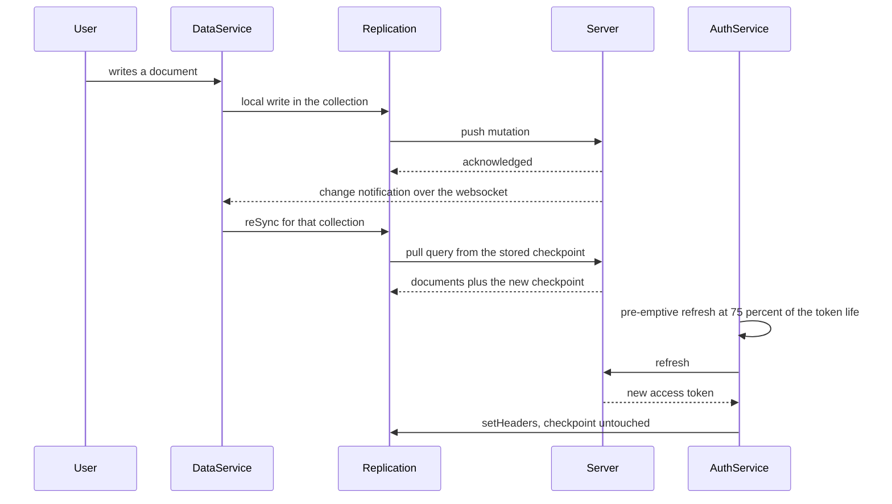
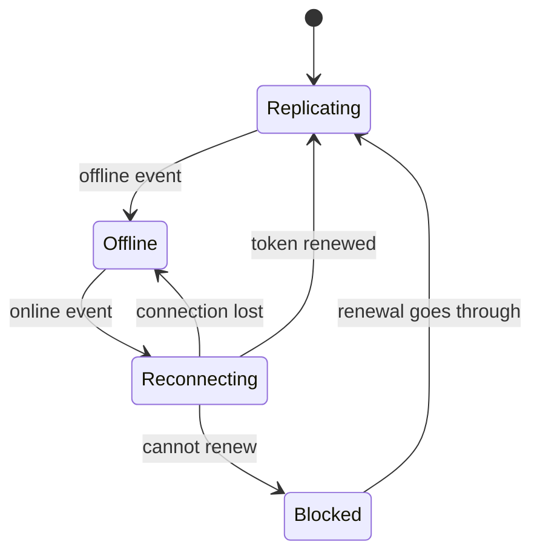
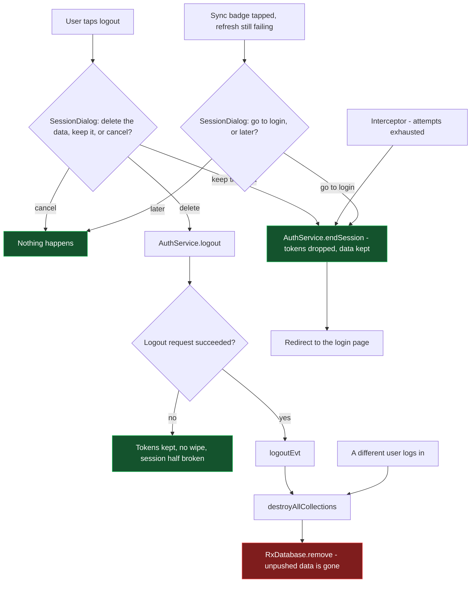

# How the sync works

Reference for the sync as it stands on `sync-problems`, and for how it differs from `dev`. Written
against the constraint the deployments impose: **the app is used where connectivity is unstable or
absent for days, and data collected offline must never be lost.**

The invariant everything else serves: **local data is destroyed only by a deliberate act** — the user
logging out and choosing to delete it, or a different user logging in on the device. No failure the app
detects by itself deletes anything, and no automatic path reaches a logout.

## 1. The pieces

| Layer | Contents | Survives |
| --- | --- | --- |
| rxdb collections, Dexie/IndexedDB | every document, including writes not yet pushed | app restart, PWA discard, days offline |
| rxdb replication meta, same database | pull checkpoint and push state per `replicationIdentifier` | app restart, replication `cancel()`, a session that ends |
| `localStorage` | auth token, refresh token, user info, config, the owner record | app restart; the tokens go on a logout, on `endSession()` and on every visit to the login page |

- **`DataService`** (`core/data`) owns the database, the collection registrations and the replications,
  and decides when a sync cycle runs.
- **`AuthService`** (`core/auth`) owns the tokens: it renews them, reports the session state on
  `authenticated`, and ends a session locally with `endSession()`.
- **`JWTInterceptor`** watches `HttpClient` traffic — never the replications, which use rxdb's own
  `fetch` — refreshes and replays a request that failed authentication, and reacts to reconnections.
- **`AuthGuard`** decides whether a navigation proceeds. It never blocks a session that exists.
- **`MainNav`** (`material/main-nav`) is what the user sees: the sync icon, its badge and its tooltip,
  the logout icon, and the `SessionDialog` both icons open before anything happens to the session.

## 2. Normal operation

### 2.1 Starting a session

**Database.** Creation awaits any pending teardown and retries a few times: rxdb releases a database
name asynchronously, so on `dev` a logout followed at once by a login threw DB8 and left the app with
no database at all. If the owner recorded for that database is a different user, the storage is removed
first — see §5.

**Collections.** A registration waits for the database of the session it was asked for, retrying a
bounded number of times. One that never makes it is reported — console, badge, Sentry — because the
collection is then absent for the whole session; on `dev` it failed silently.

**Reads and writes while that happens.** A login opens a new `RxDatabase` even when the previous
session only ended and its data was kept, and the collections are added to that instance
asynchronously. A data request landing in between waits for its collection instead of failing. On
`dev` it was told at once that the collection did not exist — for a write, a document the user
believed saved and lost without a word — and the console showed seven such requests on every single
login, so this was the normal case and not an edge one. The wait carries the same budget a
registration gets, and a collection that never arrives is reported to Sentry rather than being
indistinguishable from a wrong name. A teardown is the exception: it still fails fast, having nothing
to gain from waiting for what it is about to remove.

**Replications.** Authenticated, online and holding a token, every registered collection without an
active sync gets one.

**The initialization screen** comes down when every registered collection reports its first cycle
complete. On `dev`, with `live: false`, that report was keyed to a *document update* — the only signal
a non-live cycle had when the check was written, two years before non-live cycles got a completion
event of their own — and nothing updates a document at login. So no collection ever reported, and the
screen was left to `initializationScreenMaxDuration` to time out: 25 seconds of spinner on every
login, whatever the data actually did. It is keyed to the completed cycle now, in both modes.

### 2.2 What the user is allowed to see

**Where it lives.** The permission context is held in memory by `PermissionContextService` and nowhere
else: no local storage, no collection of its own. It is rebuilt from `user_data`, `user_group` and
`user_role` on every start and dies with the page. What survives on disk are the documents, never the
permissions computed from them.

**Written once, by whichever computation gets there first.** `addToContext()` refuses a key it already
holds, and says nothing. `getActiveUserPermissions()` is reached from the route guard, the main nav,
the dashboard menu and the importers, so several computations race and only the first is kept. On
`dev` that first one ran before the pull had landed: with the previous session's documents still on
disk it froze on the permissions of the day before, and every later - correct - recomputation was
discarded in silence. A permission changed in the meantime stayed invisible until a logout, which
destroys the database and so leaves nothing stale to read. That is the whole reason a logout looked
like the only way to pick up new permissions.

**The wait.** The computation now waits for the first replication cycle of those three collections.
The wait sits inside `getActiveUserPermissions()`, not in one caller, so every caller inherits it;
gating a single one leaves the others free to win the race. Offline, or backendless, it does not wait
at all - an app that hesitates at startup where there is no network is worse than one working on
yesterday's permissions. The cap is 15s, deliberately under `initializationScreenMaxDuration`, and a
cap that expires is reported to Sentry: the session then runs on local permissions, which is
recoverable but worth knowing.

**A grant that widens.** The right filter is not enough. The pull asks for what changed after the
checkpoint, and a document granted today did not change - it became visible. So the grants of the last
session are recorded next to the owner record, under `dino_pull_grants:<database name>`, and the
difference against the current context says which ids to ask for outright. That question is composed
with `_or` across every dimension that widened - the schemas and each metric type - and sits inside
the `_and` of the current checks, so it can only reach documents the permissions already allow. It is
asked once: cleared when the collection reaches in-sync, and the new grants are recorded only when the
last collection is done, so an app closed halfway through asks again at the next start. The first
start after the release registers the grants and fetches nothing extra.

**A grant that narrows.** No backfill, and nothing deleted - the documents stay on disk, which is the
invariant. A revoked metric disappears from the lists on its own, because the metric managers declare
a `canView` that checks the context. Form schemas do not have one yet, so a revoked schema still shows.
And the form data of a revoked metric stay visible on purpose: hiding them would hide the records
collected offline and not yet pushed, which the user could then neither see nor export.

**A reload is enough.** None of this is tied to ending a session. `_refreshDb` starts at `ready`, and
the subscription that resets it ignores the `init` event a restored session emits, so a plain reload
rebuilds the database, the collections and the context exactly as a login does.

### 2.3 The steady state, online

**Pull** asks for what changed after the checkpoint. When the response is empty the checkpoint it was
asked from is kept; `dev` reset it to the epoch, so a synced app re-downloaded whole collections on
every cycle.

**Push** sends what rxdb considers unpushed. A rejected push is retried three times, then the
collection is given up on — §4.

**A full sync** (the icon) refreshes the token and asks every active sync for a cycle. The replication
states are reused, so the checkpoints stand. On `dev` a full sync was an implicit side effect of the
token renewal, which tore down and recreated every replication.

**With `live: false`** — some environments are configured that way — the tap is the only trigger:
nothing replicates on its own, and a token renewal in particular does not. rxdb cancels a non-live
replication as soon as its first cycle is in sync, so there is no state left to `reSync()`: the tap
rebuilds the replication, which is what runs a cycle. A full sync over sixteen collections is
therefore sixteen rebuilds, and that is what a full sync costs in this mode, not a defect.

**The second non-live pass, and who asks for it.** A non-live cycle pulls and then pushes, so what it
pushed needs one more pull to come back as the backend resolved it. That pass is asked for by the
cycle that pushed, for its own collection alone: `sent$` stays silent when the documents came from the
pull, and fires only for the collection the user changed. On `dev` the main nav asked for it instead,
by reacting to the "a cycle finished" event — so *any* cycle dragged a full sync of every collection
behind it, the one each login runs included. A login cost sixteen cycles and then sixteen rebuilt
replications that pushed nothing at all; it is now one pass with no rebuild, and a sync after editing
one document is sixteen cycles plus a single rebuild of that document's collection.

### 2.4 Going offline, and coming back

**Offline** the replications stop and the documents and push state stay on disk. The token is treated
as usable whatever its expiry, so the session stands, navigation is never blocked and the app keeps
working on local data. A refresh short-circuits to success without a request, so **no retry budget is
ever spent offline**, however long it lasts. The pre-emptive timer re-arms with a 60s floor until the
token actually expires, then stops: a handful of wake-ups, then silence for days.

**Reconnecting** is driven by the interceptor, on the `online` event: it re-evaluates the token and
refreshes if needed, including for a session that *started* offline — the normal case for a tablet
whose PWA was discarded and relaunched without a network. On `dev` this handler could never run: it
tested a truthy object instead of its `token` property, so the refresh inside was unreachable.
Meanwhile the replications restart and their first rejected JWT asks for a refresh too; refreshes are
single-flight, so both paths share one request.

On success the replications resume from their stored checkpoint, which is what pushes the backlog. On
failure nothing is torn down: the app moves to **Blocked**, §3.

### 2.5 Renewing the token

The access token lives 900 seconds and the refresh is scheduled at **75% of that**, 11m15s, leaving
3m45s of margin — enough for a wrong device clock, a slow round trip and a timer throttled in the
background. Refreshing at expiry means discovering it through whatever request fails first, which is
how a renewal becomes an error path; that was `dev`.

Refreshes are **single-flight**: interceptor, guard, timer and replications share one call. On `dev`
each requester made its own, and every one of them re-emitted the token, which reconfigured every
running replication.

A renewed token reaches the running replications with `setHeaders()`: the header is swapped, nothing is
cancelled, and the replication state — with the checkpoint it holds — is left alone. `dev` cancelled
each replication and created it again instead, so every collection ran its start-up cycle: a pull from
the checkpoint and a fresh look at what is unpushed. Renewals were occasional there. Here they are
periodic, and that is what made `setHeaders()` necessary: the pre-emptive refresh would otherwise
rebuild every replication every eleven minutes.

## 3. When the token cannot be renewed

A failed refresh proves nothing: the same negative result covers a 5xx, a timeout, a request that
failed while `navigator.onLine` was still true, and a credential the server has revoked. So a failure
changes as little as possible.

**The session state is untouched.** On `dev` three separate places reported `authenticated: false` on a
failed refresh, and any of them dismantled the session: the permission context reset, the permissions
gave up on an empty list, the menu emptied, the replications stopped, the user name disappeared. Coming
back online after days offline hit one of them every time, since the access token is always expired by
then. None of them reports it any more — an expired access token with a refresh token in hand is a
session to renew, and what decides is the refresh itself.

**What the user sees.** A failed renewal adds an `authentication` entry to `problemSyncing`, which
lights the badge on the sync icon — the only signal that reaches a user in the field, since the report
that goes with it ends up in Sentry. The entry follows whether the token is *usable*, not whether the
call reported success: offline a refresh reports success without trying. Any renewal that goes through
clears it, from whichever path asked.

The spinner is off whenever there is nothing to wait for: blocked on the token, or no replication
active. After three consecutive failed renewals the replications stop — without a token they cannot
succeed, and rxdb would retry every five seconds for as long as the app is open, which on a field
device is battery and data for nothing. The session and the data are untouched, and a renewal that goes
through brings the replications back.

**Nothing here ends the session by itself, with one exception.** A sync cycle that cannot renew the
token skips itself, lights the badge and counts, and that is all: the count only decides how loud the
Sentry report is. It used to end the session at three — wrong, because the replication error handlers
also start sync cycles, so three background retries with a dead token sent the user to a login page
with no gesture of theirs and no question asked. The one automatic session end left is the interceptor,
after `retryAttemptsMax` (1 in every environment) failed refresh *rounds* — rounds, not requests,
because the call is shared and several requests failing inside one round trip are one attempt.

**Ending a session is not a logout.** `endSession()` drops the tokens, cancels the pre-emptive timer
and reports `authenticated: false` with `evt: 'expired'`. No http call, so it works offline too.
Nothing is destroyed: the next login starts from a new refresh token and resumes the replications from
their checkpoint. It also clears `dbToken` and the registered collections: those hold `RxCollection`
handles of the database *instance* of that session, which the next login closes and replaces — over the
same storage, data intact. Left behind, they make the next session replicate collections of an instance
that no longer exists, and its spinner never stops.

**The way out is the sync icon**, and it tries before it asks. One tap means "the connection is back",
so the icon refreshes first: when only the auth server had been unreachable, nothing else is asking for
a token by then — the replications are stopped and no timer is armed. If that refresh works the badge
goes out and the cycle runs. Only if it fails does the dialog appear: end the session keeping the data
and go to the login page, or later. The route matters because the only path to a login page a user knows
is the logout button, the one action that destroys the data; and `LoginGuard` closes the login route
while the app still reports a session, so ending it first is what makes the page reachable. There the
notice names the account whose data is on the device, and the backlog goes out on the next login.

**Navigation keeps working in the meantime.** The guard refreshes on every activation and, when that
fails, lets the navigation through as long as a session is reported — the same thing it does offline.
It used to redirect to the login page, a redirect that could not be followed: with the session
deliberately left alone, `LoginGuard` found the app still authenticated and cancelled the navigation
outright, locking the user on whatever page they were on, in silence. With no session at all the
redirect stays, and there `LoginGuard` agrees there is nothing to protect.

## 4. When the server refuses the data

A push rejected with a `constraint-violation` is retried three times, and most of the time that is the
end of it: the replications run in parallel and in no particular order, so a `log` row can reach the
server before the `form_data` it references, and by the retry that document is there.

Three failures in a row are the other case: the collection stops, the badge names it, the data stays on
disk, nothing reaches the server. In practice that comes from a massive `form_data` import — with the
default `batchSizePush` of 20000 the whole pending queue travels in one mutation, so one document the
server refuses blocks everything behind it. And the app names the collection, not the document: the
GraphQL message in the console and in Sentry is the only clue.

**It stops, and it is tried again.** The collection stays registered, so the next token renewal — about
every eleven minutes — sets its replication up again, and the new round fails its three attempts and
stops again: a document refused today may be acceptable tomorrow, and reaching in-sync is what proves
the queue finally went through. What that round does **not** do is clear the badge or repeat the Sentry
report — the collection stays marked as abandoned until it catches up, so the signal persists instead of
blinking off for minutes at a time. This is also the one cycle a renewal still starts with `live: false`:
what gets set up again is a collection with no active sync, whichever mode the sync is in.

That matters because of what the user is expected to do: the session stays alive on purpose, so they
can see the error, export the local database from the user area, and choose when to log out — the only
way out of this state, and the one action that destroys the data.

**A tap on the sync icon says so, before anything else.** With a collection in this state the icon
opens the corrupted-data message — the data cannot be saved, contact the admin or export it and then
log out — with a single button, even when the session is healthy. Nothing in that dialog can end the
session: a logout here would destroy the very data still to be exported, and a login fixes nothing,
since the token is fine and the documents are refused. The three "Resyncing" snackbars per round still
appear.

## 5. What destroys local data

`RxDatabase.remove()` is the only operation that deletes documents, and only two paths reach it.

**An explicit logout**, and only after the user has chosen it in the dialog the logout icon opens,
whose other answer ends the session and keeps the data. The teardown hangs off the logout http call, so
a logout whose request never reaches the server clears nothing: there the data survives by accident,
not by design.

**A different user logging in.** Before the new session gets a database, the logged in user is compared
with the owner recorded in `dino_db_owner:<database name>`; when they differ the storage is removed —
by name if no instance is open, so a fresh start does not have to open the previous user's database
just to throw it away. This is what keeps "a session that ends without wiping" from becoming a privacy
leak between operators sharing a tablet.

The owner record carries the account name next to the id, because it is read where nothing else is
left to ask: the login page clears the tokens, the user info and the config on every visit. That name
is what the notice on the login page shows.

Everything else stops short on purpose: a refresh that fails on reconnection, any authentication
failure while offline, and a replication whose JWT is rejected. The last one is worth spelling out:
replications never reach the interceptor or its budget, and twenty collections failing at once produce
one shared refresh and no logout risk.

## 6. Differences from `dev`

| Area | `dev` | now |
| --- | --- | --- |
| A failed refresh | reported `authenticated: false`: permission context reset, sync stopped, menu emptied | changes nothing but the badge |
| A sync cycle that cannot renew the token | logout and wipe on the first one | skips the cycle and lights the badge; never ends the session |
| Interceptor retry budget | never reset; the 2nd auth failure of the session logged out and wiped | reset by every successful refresh, counted per refresh round |
| A session the app gives up on | logout: tokens cleared, database destroyed | `endSession()`: tokens dropped, data kept, redirect to login |
| Logout | immediate and destructive | asks first: delete the data, keep it, or cancel |
| Sync icon with the badge | ran a cycle that could not succeed | tries a refresh, then asks; explains refused data instead of retrying it |
| Navigation with a token that will not renew | redirect to login, cancelled by `LoginGuard`: user stuck, in silence | allowed, on local data |
| Pre-emptive refresh | none; expiry discovered by a failing request | at 75% of the lifetime, re-armed offline with a 60s floor |
| Concurrent refreshes | one call per requester, each reconfiguring every replication | single-flight |
| Reconnection refresh | dead code | live, and not skipped for a session that starts offline |
| Interceptor on 401 | replayed the request into the void, returned null to the caller | refreshes, replays, returns the real response |
| Token renewal cost | full replication restart, whole-collection re-pull, mass push | `setHeaders()` on the running replication |
| Empty pull response | checkpoint reset to the epoch, endless re-pull | the requested checkpoint is kept |
| Token expiry check | valid to its last instant, and a token it could not decode threw: a garbage value left in storage kept the app from starting | ten seconds of margin, so a renewal does not race a request already on its way, and a token it cannot decode simply counts as expired |
| Sync spinner | turned while nothing could replicate, stayed on with no active sync | off when there is nothing to wait for |
| Sync badge | fed only by push retries and failed registrations | also by a token that cannot be renewed, and it no longer blinks off |
| Logout → login race | DB8, app left with no database | teardown awaited, creation retried |
| Infinite `retryWhen` loops | permissions and user data retried forever | bounded, with fallbacks |
| Failed collection registration | silent | console error, badge, Sentry |
| A read or a write while a session starts | told at once the collection did not exist; a write was lost in silence, seven times per login | waits for its collection, bounded, and reports one that never arrives |
| The second non-live sync pass | the main nav re-ran a full sync of every collection after each completed cycle | asked for by the collection that pushed, for itself |
| "First cycle complete" with `live: false` | keyed to a document update, which nothing does at login: the initialization screen waited out its 25 second timeout | keyed to the completed replication cycle, as in live mode |
| A rejected `awaitInSync()` | errored `isSyncing` for the rest of the page session, freezing the sync icon on whatever it last showed | reported, and the collection counts as idle |
| `isSyncing` | recomputed by each of its seven subscribers, every one emitting its own end-of-cycle event | one shared chain |
| The permission context | built from whatever was on disk when the first computation won the race, then frozen for the session | built after the first pull of the three collections it reads |
| A permission that widened | invisible until a logout destroyed the database and forced everything to be pulled again | the newly granted ids are asked for by id, once, at the next start |
| A revoked metric | stayed in the lists: the context never changed, so nothing checked it | disappears from them, while its documents stay on disk |
| An "items found" total | counted the raw query while the rows went through `canView`, so it did not follow what the list showed | counted after the same filter as the rows |
| Login page | said nothing about data left on the device | names the account whose data is still there |

Two consequences worth calling out.

**A logout now reliably destroys the local database, where on `dev` it sometimes did not**: a `forkJoin`
over an empty collection list never emitted, and an unbounded wait on a cancellation could skip the
removal. Those accidents occasionally preserved offline data across an unwanted logout. They are gone,
which is why no automatic path may reach a logout any more.

**The wipe was never the fix for a schema change.** rxdb keys its internal collection document by name
*and* version, so a bumped `version` with its `migrationStrategies` entry takes a different key, never
conflicts and gets migrated. DB6 means the schema changed *without* a bump: nothing to migrate, so rxdb
refuses rather than guess. It is a developer mistake whose fix is the bump — the wipe on logout only
hid it, and only if the user ever logged out.

## 7. Measured backend behaviour

How exposed the client is to a bad link depends on how the credentials behave, so it was measured by
hand against the current instance (2026-08-25) rather than assumed.

| Fact | Consequence |
| --- | --- |
| The refresh token does not rotate: `/v1/token` returns the same token it was given, and parallel calls with one token all succeed | A refresh response lost in flight costs nothing — the stored token is still the right one |
| Its expiry is a sliding 30-day window, reset to `now + 30 days` on every successful refresh | No calendar wall from the login: the credential is lost only after 30 consecutive days without one successful refresh |
| The refresh endpoint ignores the `Authorization` header | Coming back after days offline works: only the refresh token in the body matters |
| Access tokens live 900s | The pre-emptive refresh fires at 11m15s |

None of this is a contract, it is backend configuration: enabling rotation or a fixed expiry would each
reintroduce a way for the credential to die while the device holds unpushed data. No client code
depends on these four rows.

## 8. Known limits

**A dead credential needs the user.** With a refresh the server keeps rejecting, the app stops the
replications, lights the badge and waits. It does not send anybody to the login page on its own, and
the remedy is a tap on the icon. Nothing else can be done without the network and the credentials
anyway, and being pushed to a login page would interrupt the collection of data.

**Recovery depends on a gesture when only the server was down.** A real reconnection refreshes by
itself, but if the network never dropped — the auth server was unreachable, or its URL blocked — no
event fires once the replications are stopped and no timer is armed: it takes a tap, a navigation or a
reload. A failed refresh does not re-arm the timer.

**Permissions degrade to "not allowed".** The infinite retries are gone from the permission context,
the form status check and the user/group managers; on exhaustion — ten attempts, two seconds apart —
the fallbacks yield `[]`, `false` and `null`. Better than a spinner that never resolves, but a session
whose referenced documents never arrive can end up read-only after twenty seconds.

**A Hasura outage is quiet.** A response with no `errors` array is not recognised as an auth problem
and nothing lights the badge, so the spinner can turn against a server that is simply down.

**Two things worth calibrating**, both left as they are on purpose: `retryAttemptsMax` is `1` in every
environment, eager on a flapping link; and every skipped sync cycle is reported to Sentry as a warning,
which on a bad link is a stream of events for a normal condition.

**A very large grant is not backfilled in one go.** The backfill asks for the newly granted ids
alongside the checkpoint, and the checkpoint only moves forward, so a page filled entirely with
documents older than it leaves the replication where it was. Under `batchSizePull` - 20000 - that
never happens; above it, the same page would be requested again. It takes a single grant of more than
twenty thousand pre-existing documents in one collection, and the fix changes the design rather than
adding a guard, so it is recorded here instead.

**The token lives in two places.** A running replication carries the token it was created with, while
the auth checks read `localStorage`. They cannot diverge in normal use, but a second tab can do it: a
logout there clears the storage while this tab keeps replicating with the token it holds in memory, and
nothing listens for the `storage` event.

## 9. Checking by hand

The interesting paths are the ones a browser can fake in a minute, and they are worth repeating before
merging anything that touches the sync. Keep the DevTools open on Network, Console, and Application →
Local Storage plus IndexedDB. Useful dev logs: `Running the sync for …`, `NEXT PRE-EMPTIVE TOKEN
REFRESH IN …`, `AUTH TOKEN REFRESH FAILED`, `COULD NOT REFRESH THE AUTH TOKEN BEFORE SYNCING`,
`CREATING DB: …`, `Stopping sync`.

1. **A full sync does something.** Tap the icon: one call to the refresh endpoint *and* the GraphQL
   queries of every collection. On a `live: false` instance the console shows one `Rebuilding the sync
   for …` per collection, which is what a cycle costs in that mode, and then — only if a document was
   waiting — exactly one more, for the collection that pushed it. Sixteen rebuilds followed by sixteen
   more means the main nav is re-running a full sync again.
2. **A login on a non-live instance.** End the session, log in again: one `Running the sync for …` per
   collection and no `Rebuilding the sync for …` at all. The initialization screen must come down when
   the cycles complete, not 25 seconds later.
3. **A permission that widened.** With a second, admin account, add metrics to the group of the
   account under test, then reload that account's app - ending the session is not needed. The console
   shows `Permissions widened since the last session:` with the new ids, one `Backfill for …` per
   affected collection, then `Grants recorded`; the new metrics and their form data appear in the
   lists, and the "items found" total follows. The first start after the release only registers the
   grants, so this check needs a second change to show anything.
4. **Offline collection.** DevTools offline, create a record: it stays in IndexedDB, nothing goes out,
   and repeated taps on the icon do nothing.
5. **A token that will not renew.** Back online, block `/v1/token` (or break the stored refresh token).
   The badge lights up — at the latest when the access token expires and the replications start
   rejecting the JWT, within seconds of each other. Navigation between sections must keep working.
6. **The way out, and the way back.** Tap the icon: it refreshes, fails, and asks. *Later* changes
   nothing. Unblock the URL and tap again: the session recovers, badge off, no dialog. Block it again,
   tap and accept: the login page, with IndexedDB intact, the tokens gone, the notice naming the
   account, no authentication error announced — the session was ended on request, not lost — and **no
   call to the signout endpoint**.
7. **The backlog.** Log in with the same account: the record from step 4 leaves in a push mutation.
8. **Reconnection from an offline start.** Offline, replace the stored access token with a non-JWT
   string, reload, then go back online without touching anything: a refresh must fire by itself.
9. **Refused data.** With no easy way to provoke a constraint violation, emit it from the console —
   `couldNotSyncEvt.emit({collection: 'form_data', error})`. The badge stays on across renewals, and a
   tap on the icon shows the corrupted-data message with a single button: the session stays alive and
   the export in the user area still works.
10. **A different user.** Log in with another account: the database is recreated empty and the owner
    record names the new user.
11. **An explicit logout.** *Cancel* changes nothing; *keep the data* lands on the login page with
    IndexedDB and the owner record intact; *delete* gives the signout call, IndexedDB removed, the
    owner record gone, and no notice on the login page.

Steps 10 and 11 destroy the local database on purpose — they are the proof that the destructive path
still works when it should. Leave them last.
